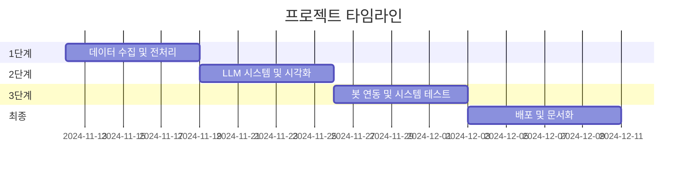
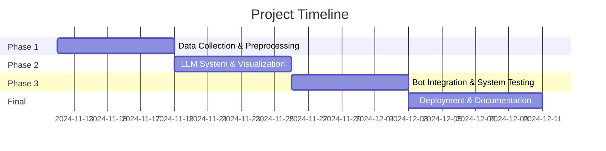

# 📰 AI 뉴스 요약 봇 | AI News Summary Bot

[](https://www.python.org/downloads/)
[](https://python.langchain.com/)
[](https://opensource.org/licenses/MIT)

[English](#english) | [한국어](#korean)

<a name="korean"></a>

## 한국어 설명

최신 LLM 기술을 활용하여 다양한 카테고리의 뉴스를 자동으로 요약하고 분석하는 AI 봇 프로젝트입니다.

### 🌟 주요 기능

- **자동 뉴스 수집**:

  - 경제 및 주식 시장 정보
  - 주요 정치 뉴스
  - 글로벌 이슈
  - 속보 및 주요 뉴스

- **스마트 요약**:

  - LLM 기반 콘텐츠 요약
  - 핵심 포인트 추출
  - 트렌드 분석
  - 중요도 순위 산정

- **데이터 시각화**:

  - 인터랙티브 차트 및 그래프
  - 경제 데이터 시각화
  - 트렌드 분석 시각화
  - 주요 지표 대시보드

- **편리한 전달 시스템**:
  - 매일 아침 뉴스 브리핑
  - 대화형 정보 검색
  - 맞춤형 알림 서비스

### 🛠️ 사용 기술

- **백엔드**:

  - Python 3.8+
  - LangChain (RAG 구현)
  - LLaMA 3 / OpenAI
  - FastAPI/Flask

- **데이터 수집**:

  - Beautiful Soup 4
  - Requests
  - NewsAPI
  - GDELT Project API

- **데이터 시각화**:

  - Matplotlib
  - Plotly

- **배포**:
  - Discord.py
  - 카카오톡 챗봇 API

### 📋 프로젝트 일정



### 🚀 시작하기

#### 필수 조건

```bash
python 3.8+
pip
가상환경 (권장)
```

#### 설치 방법

1. 저장소 복제

```bash
git clone https://github.com/yourusername/ai-news-summary-bot.git
cd ai-news-summary-bot
```

2. 의존성 설치

```bash
pip install -r requirements.txt
```

3. 환경 변수 설정

```bash
cp .env.example .env
# .env 파일에 API 키와 설정을 입력하세요
```

### 👥 팀 구성

| 이름   | 역할                    | 담당 업무                                     |
| ------ | ----------------------- | --------------------------------------------- |
| 권준영 | 데이터 엔지니어링 리드  | - 데이터 수집 파이프라인<br>- LLM 시스템 개발 |
| 최동주 | 프론트엔드 및 통합 리드 | - 데이터 시각화<br>- 봇 연동                  |

### 📈 프로젝트 구조

```
ai-news-summary-bot/
├── data/
│   ├── raw/
│   └── processed/
├── src/
│   ├── collectors/
│   ├── processors/
│   ├── visualization/
│   └── bot/
├── tests/
├── config/
├── requirements.txt
└── README.md
```

---

<a name="english"></a>

## English Description

An intelligent news summarization and analysis bot that provides daily digests of important news across various categories using advanced LLM technology.

### 🌟 Features

- **Automated News Collection**:

  - Economic and Stock Market Updates
  - Political Headlines
  - Global Events
  - Breaking News

- **Smart Summarization**:

  - LLM-powered content summarization
  - Key points extraction
  - Trend analysis
  - Importance ranking

- **Data Visualization**:

  - Interactive charts and graphs
  - Economic data visualization
  - Trend analysis visualization
  - Key metrics dashboard

- **Convenient Delivery**:
  - Daily morning news briefings
  - Chat-based information retrieval
  - Customizable notifications

### 🛠️ Technology Stack

- **Backend**:

  - Python 3.8+
  - LangChain for RAG implementation
  - LLaMA 3 / OpenAI
  - FastAPI/Flask

- **Data Collection**:

  - Beautiful Soup 4
  - Requests
  - NewsAPI
  - GDELT Project API

- **Data Visualization**:

  - Matplotlib
  - Plotly

- **Deployment**:
  - Discord.py
  - KakaoTalk Chatbot API

### 📋 Project Timeline



### 🚀 Getting Started

#### Prerequisites

```bash
python 3.8+
pip
virtual environment (recommended)
```

#### Installation

1. Clone the repository

```bash
git clone https://github.com/yourusername/ai-news-summary-bot.git
cd ai-news-summary-bot
```

2. Install dependencies

```bash
pip install -r requirements.txt
```

3. Configure environment variables

```bash
cp .env.example .env
# Edit .env with your API keys and configurations
```

### 👥 Team

| Name          | Role                        | Responsibilities                                       |
| ------------- | --------------------------- | ------------------------------------------------------ |
| Junyoung Kwon | Data Engineering Lead       | - Data collection pipeline<br>- LLM system development |
| Dongju Choi   | Frontend & Integration Lead | - Data visualization<br>- Bot integration              |

### 📈 Project Structure

```
ai-news-summary-bot/
├── data/
│   ├── raw/
│   └── processed/
├── src/
│   ├── collectors/
│   ├── processors/
│   ├── visualization/
│   └── bot/
├── tests/
├── config/
├── requirements.txt
└── README.md
```

### 🤝 Contributing

This project is part of an academic coursework for Open Source Software course. While it's primarily maintained by the team members, we welcome suggestions and feedback through issues.

### 📝 License

This project is licensed under the MIT License - see the [LICENSE](LICENSE) file for details.

### 📧 Contact

- Junyoung Kwon - 21101718
- Dongju Choi - 21101234

Project Link: [https://github.com/yourusername/ai-news-summary-bot](https://github.com/yourusername/ai-news-summary-bot)
